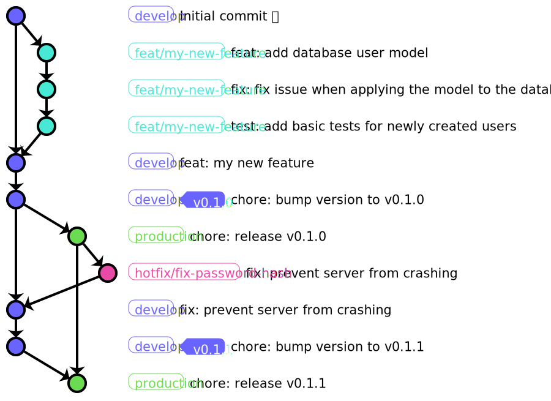

# **Y**et **A**nother **G**it **S**trategy



# How It Works

The default branch in our Git-Repository is called `develop`. This is our current development version, which is deployed to our staging environment. All other branches are started off of this branch.
We also have a `production` branch. This is the code that is currently running in production.

## Feature-Branches

Generally, new code is written in new, short-living branches, however this model does allow for small and concise changes to be pushed directly into the `develop` branch. This is only acceptable if the changes are small or cosmetic, have already been tested and don't require a code review.

For all other code, you should create a new branch off of develop. These have a naming convention:
`<type>/<branch-name>` (e.g `feat/user-info-api`)

```bash
$ git checkout develop
$ git checkout -b feat/my-new-feature
```

While working, track your progress in a [draft (github)](https://github.blog/2019-02-14-introducing-draft-pull-requests/) or [Work In Progress Pull-Request (gitlab)](https://docs.gitlab.com/ee/user/project/merge_requests/work_in_progress_merge_requests.html) and request a review from at least one Team-Mate when you have finished your feature. When all checks pass (assuming you have set up [CI/CD](#ci-cd)) you [squash and merge](https://help.github.com/en/github/collaborating-with-issues-and-pull-requests/about-pull-request-merges#squash-and-merge-your-pull-request-commits) the branch into develop (It's recommended to [require a linear history](https://help.github.com/en/github/administering-a-repository/requiring-a-linear-commit-history) and [disable other merge types](https://help.github.com/en/github/administering-a-repository/configuring-commit-squashing-for-pull-requests) on your respective git host).

## Commits

When commiting your code to these branches or `develop`, you also need to follow a naming convention (based on [Conventional Commits](https://www.conventionalcommits.org/en/v1.0.0/)):
`<type>[optional scope]: <description>`

For types, we recommended to stick to [Angular's commit types](https://github.com/angular/angular/blob/production/CONTRIBUTING.md#type)

```bash
$ git commit -m "feat: add database user model" \
  -m "BREAKING: This changes some names in our rest-api"
```

## Releases

Before releasing a version to production, it is recommended to sanitize-check your current staging environment — even if all tests pass. If you are confident, the next step is to (optionally) commit a version bump to `develop`:

```bash
$ git checkout develop
$ git commit -m "chore: bump version to v0.1.0"
$ git tag v0.1.0
$ git push --tags
```

The final step is merging this to your `production` branch:

```bash
$ git checkout production
$ git merge develop --ff-only
$ git push
```

## Pre-Releases

Pre-Releases are tagged development versions. To automate pushing your library to npm or similar, you need to add a release step to your CI/CD system that runs on every tag `*-{alpha,beta}.*`

```bash
$ git checkout develop
$ git commit -m "chore: bump version to v0.1.0-beta.0"
$ git tag v0.1.0-beta.0
$ git push --tags
```

## Hotfixes

Hotfixes should be created as pull-request from a `fix`-branch directly to production. These can then be reviewed and squash-merged like normal branches.

```bash
$ git checkout production
$ git checkout -b "hotfix/fix-password-hash"
```

After a hotfix lands in production, a more elaborate fix can be created for develop or the fix can be cherry-picked:

```bash
$ git checkout develop
$ git cherry-pick {commit-hash}
```
